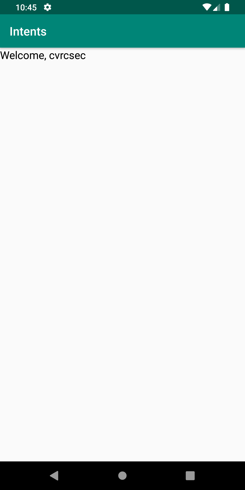

# Mobile Application Development Lab Record

## 1. Simple Hello World Program

  * ### AndroidManifest.xml
    ```
      <?xml version="1.0" encoding="utf-8"?>
      <manifest xmlns:android="http://schemas.android.com/apk/res/android" package="com.android_lab.hello_world">

          <application
              android:allowBackup="true"
              android:icon="@mipmap/ic_launcher"
              android:label="@string/app_name"
              android:roundIcon="@mipmap/ic_launcher_round"
              android:supportsRtl="true"
              android:theme="@style/AppTheme">
              <activity android:name=".MainActivity">
                  <intent-filter>
                      <action android:name="android.intent.action.MAIN" />

                      <category android:name="android.intent.category.LAUNCHER" />
                  </intent-filter>
              </activity>
          </application>

      </manifest>
    ```

  * ### activity_main.xml
    ```
      <?xml version="1.0" encoding="utf-8"?>
      <androidx.constraintlayout.widget.ConstraintLayout xmlns:android="http://schemas.android.com/apk/res/android"
          xmlns:app="http://schemas.android.com/apk/res-auto"
          xmlns:tools="http://schemas.android.com/tools"
          android:layout_width="match_parent"
          android:layout_height="match_parent"
          tools:context=".MainActivity">

          <TextView
              android:id="@+id/textview"
              android:layout_width="wrap_content"
              android:layout_height="wrap_content"
              android:text="Hello World!"
              android:textColor="@android:color/black"
              android:textSize="18sp"
              app:layout_constraintBottom_toBottomOf="parent"
              app:layout_constraintLeft_toLeftOf="parent"
              app:layout_constraintRight_toRightOf="parent"
              app:layout_constraintTop_toTopOf="parent" />

      </androidx.constraintlayout.widget.ConstraintLayout>  
    ```
    
    
  
  * ### MainActivity.java
    ```
      package com.android_lab.hello_world;

      import androidx.appcompat.app.AppCompatActivity;

      import android.os.Bundle;
      import android.widget.Toast;

      public class MainActivity extends AppCompatActivity {

          @Override
          protected void onCreate(Bundle savedInstanceState) {
              super.onCreate(savedInstanceState);
              setContentView(R.layout.activity_main);

              Toast.makeText(this, "Hello, World!", Toast.LENGTH_LONG).show();
          }
      }
    ```
  
  * ### Output
    

## Question 2: Demonstrate the concept of passing data through intents

  * ### AndroidManifest.xml
    ```
      <?xml version="1.0" encoding="utf-8"?>
      <manifest xmlns:android="http://schemas.android.com/apk/res/android" package="com.android_lab.intents">

          <application
              android:allowBackup="true"
              android:icon="@mipmap/ic_launcher"
              android:label="@string/app_name"
              android:roundIcon="@mipmap/ic_launcher_round"
              android:supportsRtl="true"
              android:theme="@style/AppTheme">
              <activity android:name=".HomeActivity"></activity>
              <activity android:name=".MainActivity">
                  <intent-filter>
                      <action android:name="android.intent.action.MAIN" />

                      <category android:name="android.intent.category.LAUNCHER" />
                  </intent-filter>
              </activity>
          </application>

      </manifest>
    ```

  * ### activity_main.xml
    ```
      <?xml version="1.0" encoding="utf-8"?>
      <LinearLayout xmlns:android="http://schemas.android.com/apk/res/android"
          xmlns:app="http://schemas.android.com/apk/res-auto"
          xmlns:tools="http://schemas.android.com/tools"
          android:layout_width="match_parent"
          android:layout_height="match_parent"
          android:orientation="vertical"
          tools:context=".MainActivity" >

          <TextView
              android:id="@+id/uname_label"
              android:layout_width="match_parent"
              android:layout_height="wrap_content"
              android:text="Username"
              android:textColor="@android:color/black" />

          <EditText
              android:id="@+id/uname"
              android:layout_width="match_parent"
              android:layout_height="wrap_content"
              android:ems="10"
              android:inputType="textPersonName"
              android:textColor="@android:color/black" />

          <TextView
              android:id="@+id/pwd_label"
              android:layout_width="match_parent"
              android:layout_height="wrap_content"
              android:text="Password"
              android:textColor="@android:color/black" />

          <EditText
              android:id="@+id/pwd"
              android:layout_width="match_parent"
              android:layout_height="wrap_content"
              android:ems="10"
              android:inputType="textPassword"
              android:textColor="@android:color/black" />

          <Button
              android:id="@+id/login"
              android:layout_width="match_parent"
              android:layout_height="wrap_content"
              android:text="Login" />
      </LinearLayout>
    ```
  
    
  
  * ### activity_home.xml
    ```
      <?xml version="1.0" encoding="utf-8"?>
      <LinearLayout xmlns:android="http://schemas.android.com/apk/res/android"
          xmlns:app="http://schemas.android.com/apk/res-auto"
          xmlns:tools="http://schemas.android.com/tools"
          android:layout_width="match_parent"
          android:layout_height="match_parent"
          android:orientation="vertical"
          tools:context=".HomeActivity">

          <TextView
              android:id="@+id/textView"
              android:layout_width="match_parent"
              android:layout_height="wrap_content"
              android:text="Hello, "
              android:textAlignment="center"
              android:textColor="@android:color/black"
              android:textSize="18sp" />
      </LinearLayout>
    ```

    
  
  * ### MainActivity.java
    ```
      package com.android_lab.intents;

      import androidx.appcompat.app.AppCompatActivity;

      import android.content.Intent;
      import android.os.Bundle;
      import android.view.View;
      import android.widget.Button;
      import android.widget.EditText;
      import android.widget.Toast;

      public class MainActivity extends AppCompatActivity implements View.OnClickListener {

          private EditText uname, pwd;
          private Button login;

          @Override
          protected void onCreate(Bundle savedInstanceState) {
              super.onCreate(savedInstanceState);
              setContentView(R.layout.activity_main);

              uname = findViewById(R.id.uname);
              pwd = findViewById(R.id.pwd);
              login = findViewById(R.id.login);
              login.setOnClickListener(this);
          }

          @Override
          public void onClick(View view) {
              String u = uname.getText().toString();
              String p = pwd.getText().toString();

              if(u.equals("cvrcsec") && p.equals("password")) {
                  Intent intent = new Intent(this, HomeActivity.class);
                  intent.putExtra("uname", u);
                  startActivity(intent);
              } else {
                  Toast.makeText(this, "Invalid Username/Password", Toast.LENGTH_LONG).show();
              }
          }
      }
    ```
  
  * ### HomeActivity.java
    ```
      package com.android_lab.intents;

      import androidx.appcompat.app.AppCompatActivity;

      import android.content.Intent;
      import android.os.Bundle;
      import android.widget.TextView;

      public class HomeActivity extends AppCompatActivity {

          private TextView textView;

          @Override
          protected void onCreate(Bundle savedInstanceState) {
              super.onCreate(savedInstanceState);
              setContentView(R.layout.activity_home);

              textView = findViewById(R.id.textView);

              Intent intent = getIntent();
              textView.setText("Welcome, " + intent.getStringExtra("uname"));
          }
      }
    ```
  
  * ### Output
    
    

## Question 3: Write a program to demonstrate the use of Bundles

  * ### AndroidManifest.xml
    ```
      <?xml version="1.0" encoding="utf-8"?>
      <manifest xmlns:android="http://schemas.android.com/apk/res/android" package="com.android_lab.bundles">

          <application
              android:allowBackup="true"
              android:icon="@mipmap/ic_launcher"
              android:label="@string/app_name"
              android:roundIcon="@mipmap/ic_launcher_round"
              android:supportsRtl="true"
              android:theme="@style/AppTheme">
              <activity android:name=".ConfirmActivity" android:parentActivityName=".MainActivity"></activity>
              <activity android:name=".MainActivity">
                  <intent-filter>
                      <action android:name="android.intent.action.MAIN" />

                      <category android:name="android.intent.category.LAUNCHER" />
                  </intent-filter>
              </activity>
          </application>

      </manifest>
    ```
  
  * ### activity_main.xml
    ```
      <?xml version="1.0" encoding="utf-8"?>
      <LinearLayout xmlns:android="http://schemas.android.com/apk/res/android"
          xmlns:app="http://schemas.android.com/apk/res-auto"
          xmlns:tools="http://schemas.android.com/tools"
          android:layout_width="match_parent"
          android:layout_height="match_parent"
          android:orientation="vertical"
          tools:context=".MainActivity">

          <TextView
              android:id="@+id/name_label"
              android:layout_width="match_parent"
              android:layout_height="wrap_content"
              android:text="Name"
              android:textColor="@android:color/black" />

          <EditText
              android:id="@+id/cname"
              android:layout_width="match_parent"
              android:layout_height="wrap_content"
              android:ems="10"
              android:inputType="textPersonName"
              android:textColor="@android:color/black" />

          <TextView
              android:id="@+id/age_label"
              android:layout_width="match_parent"
              android:layout_height="wrap_content"
              android:text="age"
              android:textColor="@android:color/black" />

          <EditText
              android:id="@+id/age"
              android:layout_width="match_parent"
              android:layout_height="wrap_content"
              android:ems="10"
              android:inputType="number"
              android:textColor="@android:color/black" />

          <TextView
              android:id="@+id/gender_label"
              android:layout_width="match_parent"
              android:layout_height="wrap_content"
              android:text="Gender"
              android:textColor="@android:color/black" />

          <Spinner
              android:id="@+id/gender"
              android:layout_width="match_parent"
              android:layout_height="wrap_content"
              android:entries="@array/genders" />

          <Button
              android:id="@+id/done"
              android:layout_width="match_parent"
              android:layout_height="wrap_content"
              android:text="Done"
              android:textColor="@android:color/black" />
      </LinearLayout>
    ```

    
  
  * ### activity_confirm.xml
    ```
      <?xml version="1.0" encoding="utf-8"?>
      <LinearLayout xmlns:android="http://schemas.android.com/apk/res/android"
          xmlns:app="http://schemas.android.com/apk/res-auto"
          xmlns:tools="http://schemas.android.com/tools"
          android:layout_width="match_parent"
          android:layout_height="match_parent"
          android:orientation="vertical"
          tools:context=".ConfirmActivity">

          <TextView
              android:id="@+id/textView"
              android:layout_width="match_parent"
              android:layout_height="wrap_content"
              android:text="Your Information"
              android:textColor="@android:color/black"
              android:textSize="18sp" />

          <TextView
              android:id="@+id/cname"
              android:layout_width="match_parent"
              android:layout_height="wrap_content"
              android:text="Name"
              android:textColor="@android:color/black"
              android:textSize="14sp" />

          <TextView
              android:id="@+id/cage"
              android:layout_width="match_parent"
              android:layout_height="wrap_content"
              android:text="Age"
              android:textColor="@android:color/black"
              android:textSize="14sp" />

          <TextView
              android:id="@+id/cgender"
              android:layout_width="match_parent"
              android:layout_height="wrap_content"
              android:text="Gender"
              android:textColor="@android:color/black"
              android:textSize="14sp" />

          <Button
              android:id="@+id/confirm"
              android:layout_width="match_parent"
              android:layout_height="wrap_content"
              android:text="Confirm"
              android:textColor="@android:color/black" />
      </LinearLayout>
    ```

    
  
  * ### res/values/arrays/xml
    ```
      <?xml version="1.0" encoding="utf-8"?>
      <resources>
          <string-array name="genders">
              <item>Male</item>
              <item>Female</item>
              <item>Prefer not to say</item>
          </string-array>
      </resources>
    ```
  
  * ### MainActivity.java
    ```
      package com.android_lab.bundles;

      import androidx.appcompat.app.AppCompatActivity;

      import android.content.Intent;
      import android.os.Bundle;
      import android.view.View;
      import android.widget.Button;
      import android.widget.EditText;
      import android.widget.Spinner;

      public class MainActivity extends AppCompatActivity implements View.OnClickListener {

          private EditText name, age;
          private Spinner gender;
          private Button done;

          @Override
          protected void onCreate(Bundle savedInstanceState) {
              super.onCreate(savedInstanceState);
              setContentView(R.layout.activity_main);

              name = findViewById(R.id.cname);
              age = findViewById(R.id.age);
              gender = findViewById(R.id.gender);

              done = findViewById(R.id.done);
              done.setOnClickListener(this);
          }

          @Override
          public void onClick(View view) {
              Bundle bundle = new Bundle();
              bundle.putString("name", name.getText().toString());
              bundle.putString("age", age.getText().toString());
              bundle.putString("gender", gender.getSelectedItem().toString());

              Intent intent = new Intent(this, ConfirmActivity.class);
              intent.putExtra("bundle", bundle);
              startActivity(intent);
          }
      }
    ```
  
  * ### ConfirmActivity.java
    ```
      package com.android_lab.bundles;

      import androidx.appcompat.app.AppCompatActivity;

      import android.os.Bundle;
      import android.view.View;
      import android.widget.Button;
      import android.widget.TextView;

      public class ConfirmActivity extends AppCompatActivity implements View.OnClickListener {

          private TextView name, age, gender;
          private Button confirm;

          @Override
          protected void onCreate(Bundle savedInstanceState) {
              super.onCreate(savedInstanceState);
              setContentView(R.layout.activity_confirm);

              name = findViewById(R.id.cname);
              age = findViewById(R.id.cage);
              gender = findViewById(R.id.cgender);

              confirm = findViewById(R.id.confirm);
              confirm.setOnClickListener(this);

              Bundle bundle = getIntent().getBundleExtra("bundle");
              name.setText("Name: " + bundle.getString("name"));
              age.setText("Age: " + bundle.getString("age"));
              gender.setText("Gender: " + bundle.getString("gender"));

          }

          @Override
          public void onClick(View view) {
              finish();
          }
      }
    ```
  
  * ### Output
    
    

## Question 4: Draw the diagram of an Android App Lifecycle and write a program with all the methods

  * ### AndroidManifest.xml
    ``` 
      <?xml version="1.0" encoding="utf-8"?>
      <manifest xmlns:android="http://schemas.android.com/apk/res/android" package="com.android_lab.activity_lifecycle">

          <application
              android:allowBackup="true"
              android:icon="@mipmap/ic_launcher"
              android:label="@string/app_name"
              android:roundIcon="@mipmap/ic_launcher_round"
              android:supportsRtl="true"
              android:theme="@style/AppTheme">
              <activity android:name=".MainActivity">
                  <intent-filter>
                      <action android:name="android.intent.action.MAIN" />

                      <category android:name="android.intent.category.LAUNCHER" />
                  </intent-filter>
              </activity>
          </application>

      </manifest>
    ```

  * ### MainActivity.java
    ```
      package com.android_lab.activity_lifecycle;

      import androidx.appcompat.app.AppCompatActivity;

      import android.os.Bundle;
      import android.widget.TextView;
      import android.widget.Toast;

      public class MainActivity extends AppCompatActivity {

          @Override
          protected void onCreate(Bundle savedInstanceState) {
              super.onCreate(savedInstanceState);
              setContentView(R.layout.activity_main);

              System.out.println("onCreate()");
          }

          @Override
          protected void onStart() {
              super.onStart();

              System.out.println("onStart()");
          }

          @Override
          protected void onResume() {
              super.onResume();

              System.out.println("onResume()");
          }

          @Override
          protected void onPause() {
              super.onPause();

              System.out.println("onPause()");
          }

          @Override
          protected void onStop() {
              super.onStop();

              System.out.println("onStop()");
          }

          @Override
          protected void onDestroy() {
              super.onDestroy();

              System.out.println("onDestroy()");
          }
      }
    ```
  
  * ### Activity Lifecycle Diagram
    
  
  * ### Output
    ```
      Output in Run Tab:
      
      I/System.out: onCreate()      // App Starts
      I/System.out: onStart()
      I/System.out: onResume()
      I/System.out: onPause()       // User presses Home Button
      I/System.out: onStop()
      I/System.out: onStart()       // User open app again
      I/System.out: onResume()
      I/System.out: onPause()       // User presses Recent Apps Button
      I/System.out: onStop()
      I/System.out: onDestroy()     // User close app in Recent Apps
      
      Application Terminated
    ```

## Question 5: Create an Alert Dialog with three buttons

  * ### AndroidManifest.xml
    ```
      <?xml version="1.0" encoding="utf-8"?>
      <manifest xmlns:android="http://schemas.android.com/apk/res/android" package="com.android_lab.alert_dialog">

          <application
              android:allowBackup="true"
              android:icon="@mipmap/ic_launcher"
              android:label="@string/app_name"
              android:roundIcon="@mipmap/ic_launcher_round"
              android:supportsRtl="true"
              android:theme="@style/AppTheme">
              <activity android:name=".MainActivity">
                  <intent-filter>
                      <action android:name="android.intent.action.MAIN" />

                      <category android:name="android.intent.category.LAUNCHER" />
                  </intent-filter>
              </activity>
          </application>

      </manifest>
    ```
  
  * ### activity_main.xml
    ```
      <?xml version="1.0" encoding="utf-8"?>
      <LinearLayout xmlns:android="http://schemas.android.com/apk/res/android"
          xmlns:app="http://schemas.android.com/apk/res-auto"
          xmlns:tools="http://schemas.android.com/tools"
          android:layout_width="match_parent"
          android:layout_height="match_parent"
          android:orientation="vertical"
          tools:context=".MainActivity" >

          <Button
              android:id="@+id/button"
              android:layout_width="match_parent"
              android:layout_height="wrap_content"
              android:text="Open " />
      </LinearLayout>
    ```

    
  
  * ### MainActivity.java
    ```
      package com.android_lab.alert_dialog;

      import androidx.appcompat.app.AlertDialog;
      import androidx.appcompat.app.AppCompatActivity;

      import android.content.DialogInterface;
      import android.os.Bundle;
      import android.view.View;
      import android.widget.Button;
      import android.widget.Toast;

      public class MainActivity extends AppCompatActivity implements View.OnClickListener {

          private Button button;

          @Override
          protected void onCreate(Bundle savedInstanceState) {
              super.onCreate(savedInstanceState);
              setContentView(R.layout.activity_main);

              button = findViewById(R.id.button);
              button.setOnClickListener(this);
          }

          @Override
          public void onClick(View view) {
              AlertDialog.Builder builder = new AlertDialog.Builder(this);
              builder.setMessage("You need to login to use this App")
                      .setPositiveButton("Log In", new DialogInterface.OnClickListener() {
                          @Override
                          public void onClick(DialogInterface dialogInterface, int i) {
                              Toast.makeText(getApplicationContext(), "Log In button pressed", Toast.LENGTH_LONG).show();
                          }
                      })
                      .setNeutralButton("Sign Up", new DialogInterface.OnClickListener() {
                          @Override
                          public void onClick(DialogInterface dialogInterface, int i) {
                              Toast.makeText(getApplicationContext(), "Sign Up button pressed", Toast.LENGTH_LONG).show();
                          }
                      })
                      .setNegativeButton("Cancel", new DialogInterface.OnClickListener() {
                          @Override
                          public void onClick(DialogInterface dialogInterface, int i) {
                              Toast.makeText(getApplicationContext(), "Cancel button pressed", Toast.LENGTH_LONG).show();
                          }
                      })
                      .setOnDismissListener(new DialogInterface.OnDismissListener() {
                          @Override
                          public void onDismiss(DialogInterface dialogInterface) {
                              Toast.makeText(getApplicationContext(), "Alert Dialog dismissed", Toast.LENGTH_LONG).show();
                          }
                      })
                      .create()
                      .show();
          }
      }
    ```
  
  * ### Output
    

